# 🔒 Amnesia Shh

[](https://github.com/krellz/amnesia-shh/actions/workflows/ci.yaml)
[](https://github.com/krellz/amnesia-shh/actions/workflows/cd.yaml)
[](LICENSE)


Plataforma web de partilha de segredos temporários com arquitetura **Zero-Knowledge**: o servidor nunca tem acesso ao conteúdo em claro, só armazena blobs encriptados com expiração automática.

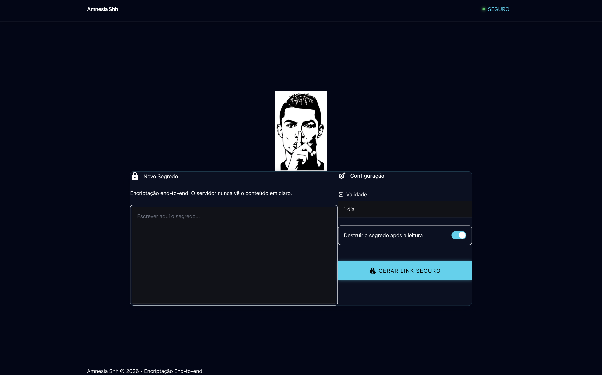

## O que é

O Amnesia Shh resolve um problema comum: partilhar uma password, uma chave de API ou uma nota confidencial por chat ou email deixa esse conteúdo para sempre nos históricos de mensagens de ambas as partes. O Amnesia Shh gera um link de uso único (ou com TTL configurável) que, depois de lido ou de expirar, deixa de existir — tanto no servidor como em qualquer histórico de conversas, porque nunca circula o conteúdo em claro, só o link.

O projeto nasceu como trabalho da unidade curricular de Computação Distribuída, mas foi construído com práticas de produção a sério: encriptação no cliente, pipeline CI/CD completa, deploy em Kubernetes com TLS automático e GitOps.

**Princípio Zero-Knowledge, em linguagem simples:** a chave de encriptação é gerada no browser e nunca sai dele — viaja apenas no fragmento (`#...`) da URL do link, uma parte que os browsers **nunca enviam** para nenhum servidor. O backend recebe e guarda apenas o blob já encriptado (AES-GCM-256); mesmo com acesso total à base de dados Redis, ninguém consegue ler o conteúdo original sem a chave que só existe nesse link.

---

## Demonstração visual

| | |
|---|---|
| Página inicial — criar segredo |  |
| Link gerado | 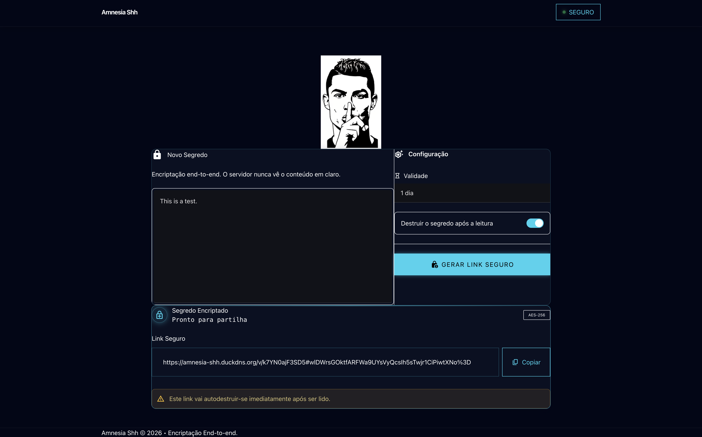 |
| Visualização do segredo | 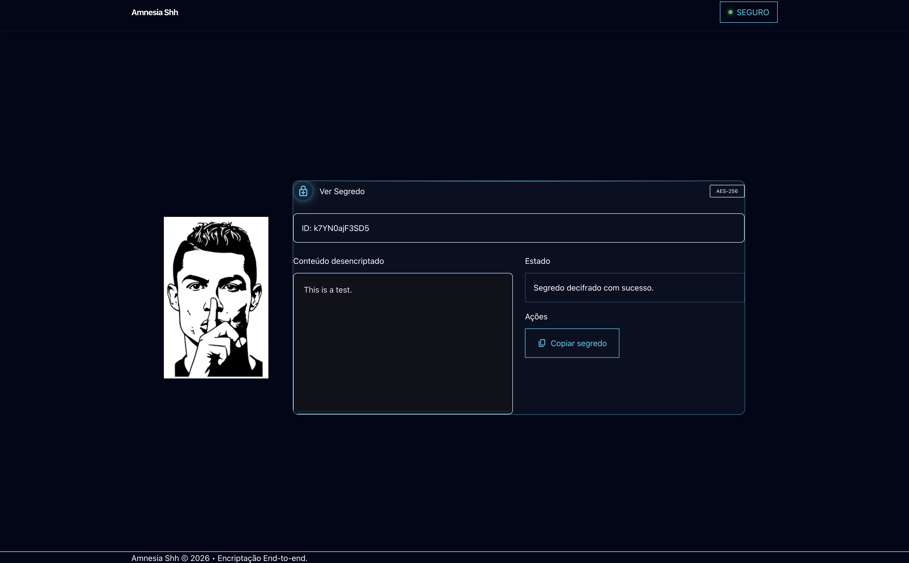 |
| Segredo destruído após leitura | 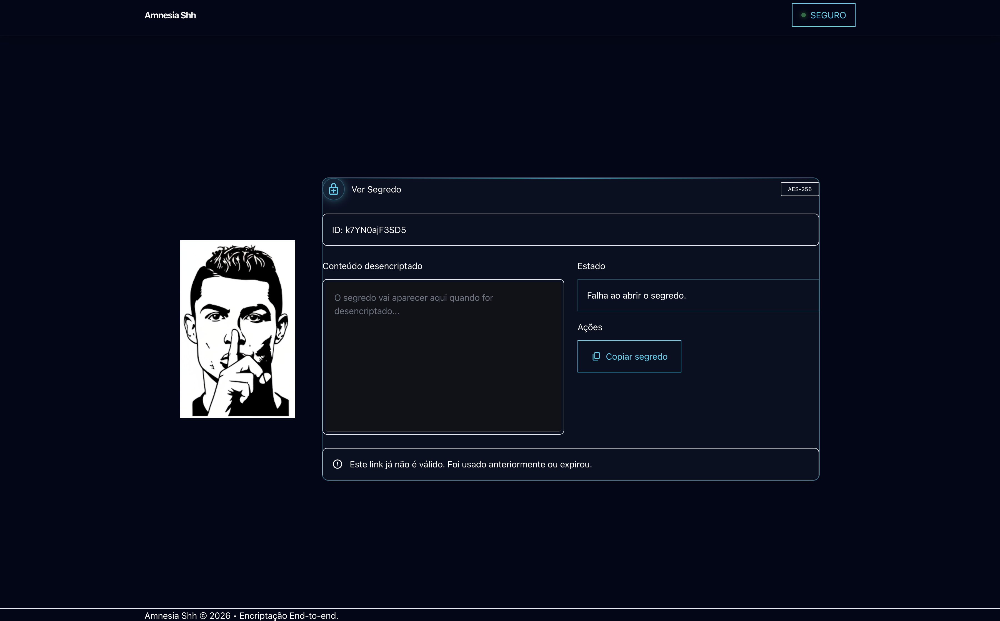 |
| ArgoCD | 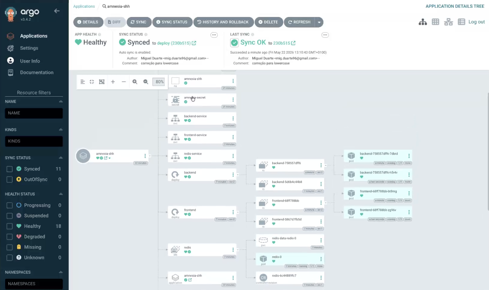 |
| Firewall | 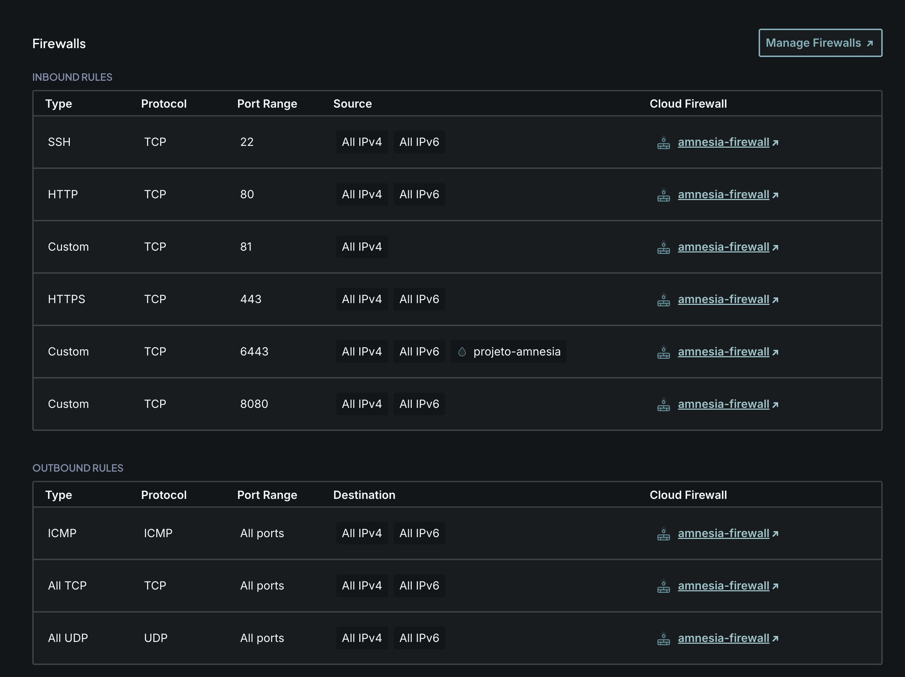 |
---

## Arquitetura

### Fluxo de pedido (aplicação)

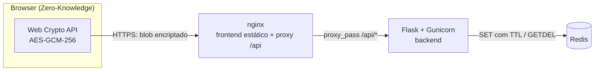

### Camada Kubernetes

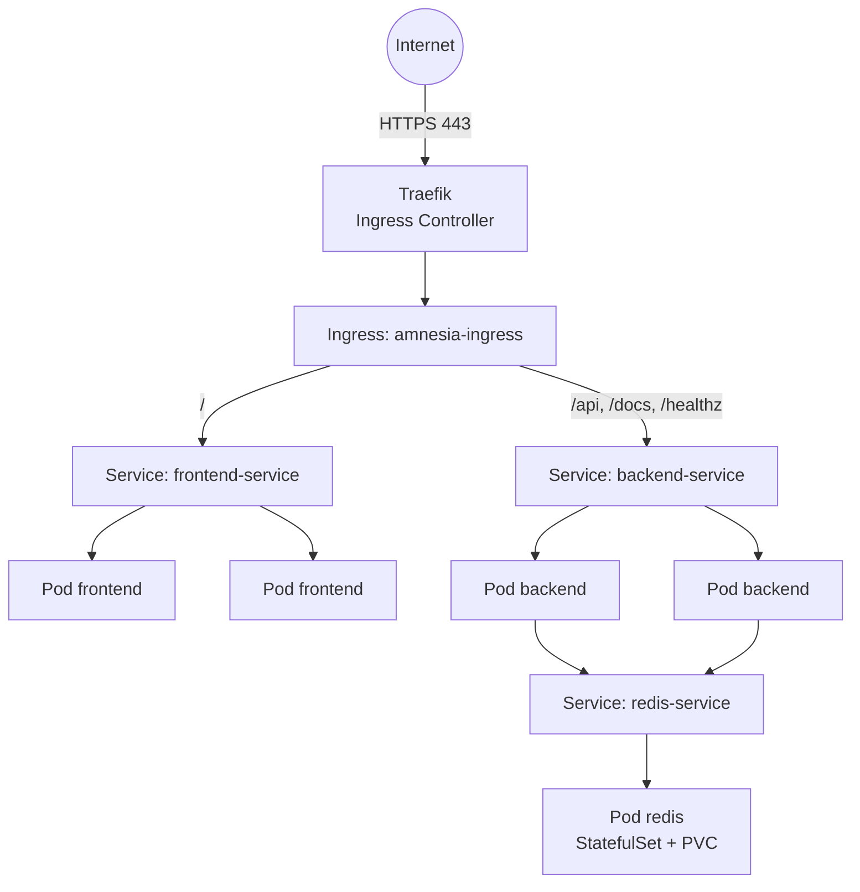

### Fluxo GitOps (CI/CD)

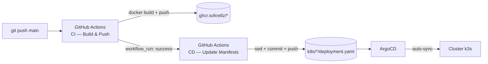

### Stateless vs. stateful

| Componente | Tipo | Motivo |
|---|---|---|
| Frontend (nginx) | Stateless | Serve ficheiros estáticos; qualquer réplica responde igual — `Deployment` com 2 réplicas |
| Backend (Flask) | Stateless | Não guarda estado em memória entre pedidos; toda a persistência vive no Redis — `Deployment` com 2 réplicas |
| Redis | Stateful | Único componente com dados a preservar (segredos com TTL) — `StatefulSet` com `PersistentVolumeClaim` dedicado |

---

## Stack técnica

| Componente | Tecnologia | Justificação |
|---|---|---|
| Encriptação | Web Crypto API (AES-GCM-256) | API nativa do browser, sem dependências externas, chave nunca sai do cliente |
| Frontend | HTML + JavaScript vanilla + Tailwind CSS | Sem build step necessário; simplicidade para uma UI pequena e focada |
| Servidor de estáticos / proxy | nginx (alpine) | Serve o frontend e faz proxy de `/api` para o backend numa só origem, evitando CORS |
| Backend | Python 3.11 + Flask + Flask-RESTX + Gunicorn | API leve com Swagger automático (`/docs`); Gunicorn para servir em produção com múltiplos workers |
| Base de dados | Redis 7.4 | TTL nativo por chave e operação atómica `GETDEL`, ideais para segredos com expiração e leitura única |
| Contentorização | Docker + Docker Compose | Ambiente reprodutível local e imagens usadas depois em produção |
| Orquestração | Kubernetes (k3s) | Distribuição leve de Kubernetes, adequada a uma única VPS |
| Ingress / TLS | Traefik + cert-manager + Let's Encrypt | Ingress controller nativo do k3s; certificados renovados automaticamente via ACME |
| CI/CD | GitHub Actions + ArgoCD | Build/push automático de imagens e sincronização GitOps do cluster sem acesso manual |
| Infraestrutura | Terraform | Configuração do servidor (instalação de k3s, cert-manager, ArgoCD) como código, versionada e repetível |
| Registry de imagens | GitHub Container Registry (ghcr.io) | Integrado no mesmo repositório/organização, sem custos nem configuração extra |

---

## Setup do zero — Desenvolvimento local

### Pré-requisitos

- [Docker](https://docs.docker.com/get-docker/) ≥ 24
- [Docker Compose](https://docs.docker.com/compose/install/) ≥ 2.20 (plugin `docker compose`, não o `docker-compose` standalone)
- `git`
- `openssl` (para gerar a password do Redis)

### Passos

```bash
# 1. Clonar o repositório
git clone git@github.com:krellz/amnesia-shh.git
cd amnesia-shh

# 2. Criar o ficheiro de variáveis de ambiente
cp .env.example .env

# Gerar uma password forte para o Redis e colocá-la no .env
openssl rand -base64 32
# copia o valor gerado e substitui REDIS_PASSWORD=changeme no .env

# 3. Criar a rede externa usada pelo compose (partilhada com um eventual reverse proxy)
docker network create proxy-network

# 4. Construir e arrancar os serviços
docker compose up -d --build

# 5. Confirmar que os serviços estão healthy
docker compose ps

# 6. Aceder à aplicação
open http://localhost:8080

# 7. Verificar o healthcheck do backend diretamente
curl http://localhost:5050/healthz
```

Resultado esperado do `docker compose ps`: os três serviços (`amnesia-redis`, `amnesia-shh-backend`, `amnesia-shh-frontend`) com estado `running (healthy)`.

A documentação interativa da API (Swagger) fica disponível em `http://localhost:5050/docs`.

### Troubleshooting

| Problema | Causa provável | Solução |
|---|---|---|
| `Error response from daemon: driver failed programming external connectivity` ou porta já em uso | Algo já está a usar a porta `8080` ou `5050` no host | Para o processo que ocupa a porta ou muda o mapeamento em `docker-compose.yml` (ex.: `"8081:80"`) |
| `network proxy-network declared as external, but could not be found` | O passo 3 (`docker network create proxy-network`) não foi executado | Corre `docker network create proxy-network` antes do `docker compose up` |
| Container `amnesia-redis` reinicia em loop / backend não liga ao Redis | `REDIS_PASSWORD` vazio ou não definido no `.env` | Confirma que o `.env` existe na raiz e tem `REDIS_PASSWORD` preenchido, depois `docker compose up -d --build` de novo |
| Pedidos a `/api/*` bloqueados por CORS no browser | `ALLOWED_ORIGIN` no backend não corresponde à origem usada para aceder à app | Em desenvolvimento local o valor por omissão é `*` (permite tudo); se tiveres alterado, ajusta a variável em `docker-compose.yml` |
| Frontend arranca mas serve ficheiros antigos ou `envsubst` falha (`nginx: [emerg] host not found`) | Variáveis `BACKEND_HOST`/`BACKEND_PORT` não chegaram ao template do nginx | Confirma os valores em `docker-compose.yml` (serviço `frontend` → `environment`) e reconstrói com `docker compose up -d --build frontend` |

### Parar os serviços

```bash
docker compose down
```

> ⚠️ `docker compose down -v` também remove o volume `redis-data` — todos os segredos ainda por ler são perdidos permanentemente (o que, dado o modelo zero-knowledge, é inofensivo, mas fica o aviso).

---

## Setup do zero — Deploy em Kubernetes (k3s numa VPS)

> Esta secção assume uma VPS/Droplet Linux já criada (ex.: Digital Ocean, Hetzner, qualquer fornecedor) com acesso SSH. O Terraform deste repositório **não cria a máquina** — configura-a: instala k3s, cert-manager e ArgoCD via SSH numa Droplet já existente.

### 6.1 — Provisionamento (Terraform)

Pré-requisitos: [Terraform](https://developer.hashicorp.com/terraform/install) ≥ 1.6, acesso SSH por chave à Droplet.

```bash
cd terraform

# Cria o ficheiro de variáveis a partir do exemplo
cp terraform.tfvars.example terraform.tfvars

# Edita terraform.tfvars com os teus valores reais:
#   droplet_ip           = "<ip-da-tua-droplet>"
#   ssh_private_key_path = "~/.ssh/id_rsa"       # ou o caminho da tua chave
#   ssh_user              = "root"
#   acme_email            = "<o-teu-email>"       # contacto ACME para o Let's Encrypt

terraform init
terraform plan
terraform apply
```

O `apply` liga-se por SSH à Droplet e corre `terraform/install-k3s.sh`, que instala o k3s, o cert-manager (com um `ClusterIssuer` Let's Encrypt já configurado com o teu `acme_email`) e o ArgoCD.

### 6.2 — Obter o kubeconfig

```bash
terraform output kubeconfig_command
# copia e corre o comando devolvido, algo como:
scp root@<droplet_ip>:/etc/rancher/k3s/k3s.yaml ~/.kube/config-amnesia
sed -i '' 's/127.0.0.1/<droplet_ip>/g' ~/.kube/config-amnesia   # macOS (sed -i '' ...)
# em Linux: sed -i 's/127.0.0.1/<droplet_ip>/g' ~/.kube/config-amnesia

export KUBECONFIG=~/.kube/config-amnesia
kubectl get nodes
```

> `KUBECONFIG` só fica definido na sessão de terminal atual. Para não teres de repetir o `export` sempre que abres um terminal novo, adiciona a linha ao teu `~/.bashrc` ou `~/.zshrc`:
> ```bash
> echo 'export KUBECONFIG=~/.kube/config-amnesia' >> ~/.zshrc
> ```

### 6.3 — DNS e TLS

1. Aponta um domínio (ou subdomínio) próprio para o IP público da Droplet, por exemplo um registo `A` para `<o-teu-dominio>` → `<droplet_ip>`.
2. O repositório usa `<o-teu-dominio>` como placeholder genérico em todos os pontos onde antes estava o domínio de demonstração original do projeto. Substitui `<o-teu-dominio>` pelo teu domínio real nos seguintes ficheiros antes de fazer build/deploy:
   - `k8s/ingress.yaml` — campos `host` e `tls.hosts`
   - `k8s/configmap.yaml` — variável `ALLOWED_ORIGIN`
   - `k8s/middleware.yaml` — diretiva `connect-src` da CSP
   - `frontend/nginx.conf` — diretiva `connect-src` da CSP
   - `backend/app.py` — diretiva `connect-src` da CSP (`SecurityHeadersMiddleware`)

   Uma forma rápida de fazer a substituição em todos de uma vez:
   ```bash
   grep -rl '<o-teu-dominio>' k8s/ frontend/nginx.conf backend/app.py | \
     xargs sed -i '' 's/<o-teu-dominio>/o-teu-dominio-real.com/g'   # macOS
   # em Linux: sed -i (sem o '')
   ```
3. O Traefik instalado pelo k3s já vem com o `ClusterIssuer letsencrypt-prod` criado no passo 6.1 (via `cert-manager`), que trata da emissão e renovação automática do certificado TLS assim que o Ingress for aplicado com o domínio correto.

### 6.4 — Secrets no cluster

```bash
kubectl create namespace amnesia-shh --dry-run=client -o yaml | kubectl apply -f -

kubectl create secret generic amnesia-secret \
  --namespace amnesia-shh \
  --from-literal=REDIS_PASSWORD='<password-forte-gerada-com-openssl>'
```

Se as imagens em `ghcr.io/krellz/amnesia-shh-*` estiverem **privadas** (é o comportamento por omissão do GHCR), o cluster precisa de um `imagePullSecret` para as poder descarregar:

```bash
kubectl create secret docker-registry ghcr-pull-secret \
  --namespace amnesia-shh \
  --docker-server=ghcr.io \
  --docker-username=<o-teu-utilizador-github> \
  --docker-password=<personal-access-token-com-scope-read:packages> \
  --docker-email=<o-teu-email>
```

Depois de criares este secret, adiciona `imagePullSecrets: [{name: ghcr-pull-secret}]` aos `spec.template.spec` de `k8s/backend/deployment.yaml` e `k8s/frontend/deployment.yaml`. Se tornares os pacotes públicos nas definições do GHCR, este passo é dispensável.

### 6.5 — Deploy: manual vs. GitOps

**Opção A — manual (uma vez, sem sincronização automática depois):**

```bash
kubectl apply -f k8s/ --recursive
```

**Opção B — GitOps com ArgoCD (recomendado):**

```bash
kubectl apply -f k8s/argocd-app.yaml
```

O `Application` do ArgoCD aponta para `https://github.com/krellz/amnesia-shh.git`, pasta `k8s/`, com `syncPolicy.automated` e `CreateNamespace=true` — o ArgoCD cria o namespace e aplica todos os manifestos sozinho, e volta a sincronizar sempre que houver um novo commit em `main` (por exemplo, vindo da pipeline de CD). Não é preciso fazer a Opção A também.

Aceder à UI do ArgoCD:

```bash
kubectl port-forward svc/argocd-server -n argocd 8080:443
# abre https://localhost:8080 — utilizador "admin"

kubectl get secret argocd-initial-admin-secret -n argocd \
  -o jsonpath="{.data.password}" | base64 -d && echo
```

### 6.6 — Verificação

```bash
# Acesso HTTPS
curl -I https://<o-teu-dominio>

# Criar um segredo (via UI, em https://<o-teu-dominio>) e copiar o link gerado

# Ler o segredo pelo link — deve devolver o conteúdo uma única vez
# Repetir o mesmo GET a seguir deve devolver 404 (segredo destruído)

kubectl get pods -n amnesia-shh
```

---

## Setup do zero — Pipeline CI/CD

1. Faz fork ou clone do repositório para a tua conta GitHub.
2. **GitHub Secrets necessários: nenhum.** Os workflows (`.github/workflows/ci.yaml` e `cd.yaml`) usam apenas o `secrets.GITHUB_TOKEN`, gerado automaticamente pelo GitHub em cada execução — não é preciso criar nem colar nenhum token manualmente.
3. Ativa as GitHub Actions do repositório: **Settings → Actions → General → Actions permissions → Allow all actions and reusable workflows**.
4. Dá permissão de escrita ao `GITHUB_TOKEN`, necessária para o CD fazer commit dos manifestos atualizados e para o CI publicar pacotes no GHCR: **Settings → Actions → General → Workflow permissions → Read and write permissions**.
5. Faz o primeiro push para `main`:
   ```bash
   git push origin main
   ```
6. Acompanha a execução em **Actions**: primeiro a `CI — Build & Push`, depois (só se a CI tiver sucesso) a `CD — Update Manifests`.
7. Confirma as imagens publicadas em **Settings → Packages** ou diretamente em `https://github.com/krellz?tab=packages` — devem aparecer `amnesia-shh-backend` e `amnesia-shh-frontend`, com tags `latest` e `sha-<commit-curto>`.
8. (Opcional, para acesso público sem `imagePullSecret`) Em cada pacote: **Package settings → Change visibility → Public**.

---

## Estrutura do repositório

```
.
├── backend/                 # API Flask — zero-knowledge, nunca vê o plaintext
│   ├── app.py                #  endpoints /api/secrets, /healthz, Swagger em /docs
│   ├── requirements.txt
│   └── Dockerfile             # build multi-stage, utilizador não-root
├── frontend/                 # UI estática servida por nginx
│   ├── index.html             # criação de segredo
│   ├── view.html               # leitura/destruição de segredo
│   ├── crypto.js                # AES-GCM-256 via Web Crypto API
│   ├── script.js                 # lógica de criação (chama a API)
│   ├── nginx.conf                # proxy /api + security headers
│   └── Dockerfile
├── k8s/                        # manifestos Kubernetes (fonte de verdade do ArgoCD)
│   ├── namespace.yaml
│   ├── configmap.yaml
│   ├── secret.yaml               # placeholder — o valor real é criado via kubectl (6.4)
│   ├── ingress.yaml
│   ├── middleware.yaml            # Middleware CRD do Traefik (ver secção Segurança)
│   ├── argocd-app.yaml             # Application do ArgoCD
│   ├── redis/                       # StatefulSet + Service headless
│   ├── backend/                      # Deployment + Service
│   └── frontend/                      # Deployment + Service
├── terraform/                  # configuração do servidor (não cria a droplet)
│   ├── main.tf                  # liga-se por SSH e corre install-k3s.sh
│   ├── variables.tf
│   ├── outputs.tf
│   ├── versions.tf
│   ├── install-k3s.sh            # instala k3s, cert-manager e ArgoCD
│   └── terraform.tfvars.example
├── .github/workflows/
│   ├── ci.yaml                   # build + push das imagens para o GHCR
│   └── cd.yaml                    # atualiza tags nos manifestos k8s/ e comita
├── docker-compose.yml           # ambiente de desenvolvimento local
├── .env.example
└── docs/screenshots/            # imagens usadas neste README
```

---

## Segurança

### Modelo de ameaças

**O que protege:**
- Leitura do conteúdo por quem tem acesso à base de dados Redis ou aos logs do servidor (só existe o blob encriptado).
- Interceção em trânsito, graças a TLS obrigatório entre o browser e o Traefik.
- Reutilização de um segredo de leitura única — a operação `GETDEL` é atómica, elimina condições de corrida entre leituras concorrentes.
- Retenção indevida de segredos — todos expiram por TTL, mesmo que nunca sejam lidos.

**O que não protege:**
- Um dispositivo do remetente ou do destinatário comprometido (malware, captura de ecrã, keylogger) antes/depois da leitura — a encriptação é feita no cliente, não substitui a segurança do endpoint.
- Abuso de disponibilidade — não existe rate limiting aplicacional (ver Limitações).
- Alguém que intercete o link **antes** da primeira leitura (ex.: partilhado por um canal já comprometido) — o link em si é a credencial.
- Acesso root à infraestrutura (Droplet, cluster) — está fora do âmbito da aplicação.

### Headers de segurança

Os headers de segurança (`Content-Security-Policy`, `Strict-Transport-Security`, `X-Content-Type-Options`, `X-Frame-Options`, `Referrer-Policy`, `Permissions-Policy`) são aplicados diretamente em dois pontos:
- **Frontend:** `frontend/nginx.conf`, via `add_header`.
- **Backend:** middleware WSGI próprio (`SecurityHeadersMiddleware` em `backend/app.py`), garantindo que os headers chegam mesmo às respostas geradas pelo Swagger/Flask-RESTX.

Existe também um `Middleware` CRD do Traefik em `k8s/middleware.yaml` com a mesma política, pensado para ser aplicado a nível do Ingress — atualmente **não está anexado** ao `Ingress` (ver anotação em `k8s/ingress.yaml`), porque a sua ativação estava a bloquear recursos carregados de CDN (Tailwind, Google Fonts). Está documentado como limitação conhecida abaixo.

### Zero-knowledge, em detalhe

A chave AES-GCM-256 é gerada no browser com `window.crypto.subtle.generateKey`, e é colocada no fragmento (`#`) da URL do link — a parte da URL que os browsers **nunca incluem** em pedidos HTTP nem em logs de servidor/proxy. O backend só recebe e devolve o blob encriptado; não existe, em nenhum ponto do sistema, um momento em que o servidor tenha simultaneamente acesso à chave e ao conteúdo encriptado.

### Testes externos

| Teste | Resultado |
|---|---|
| SSL Labs (qualidade da configuração TLS) | 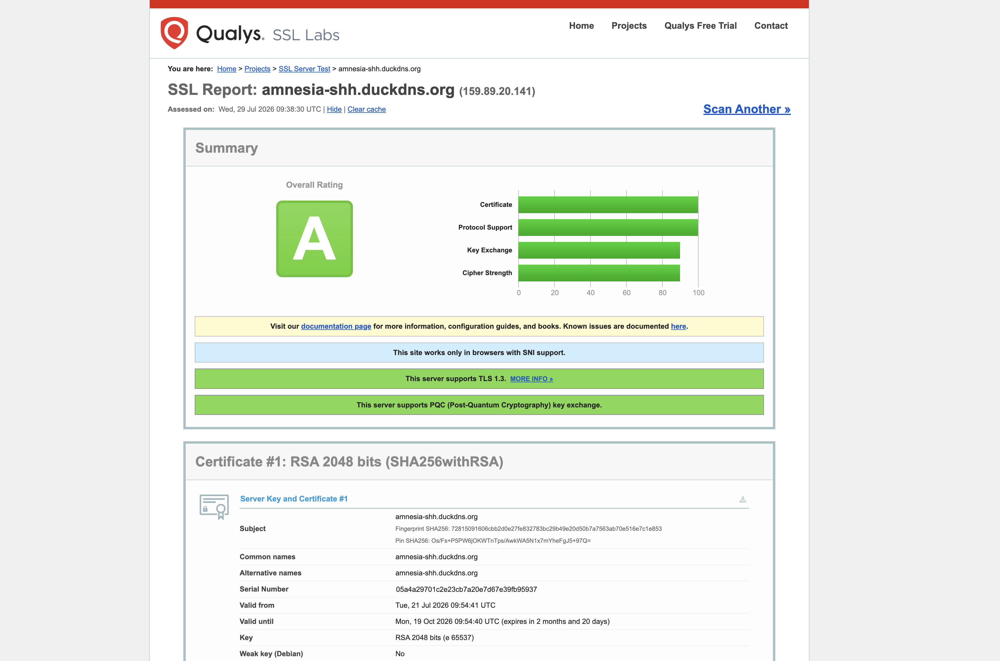 |
| OWASP ZAP (scan de vulnerabilidades web) | 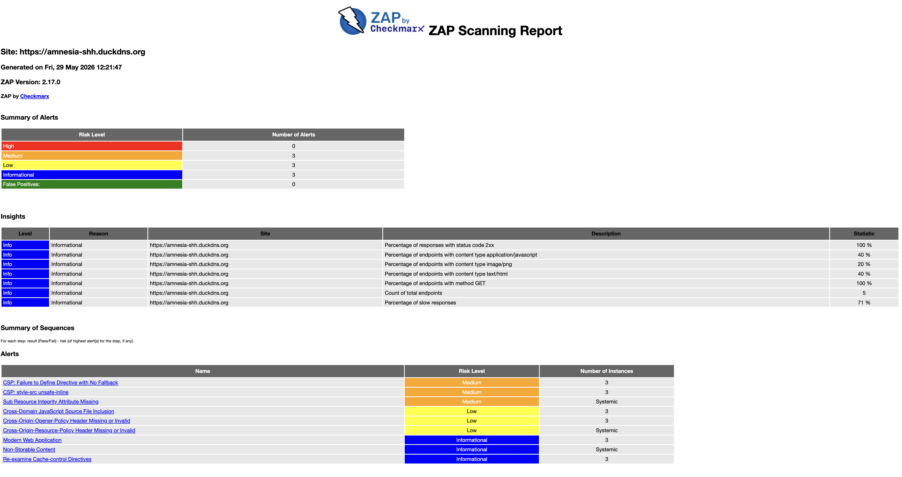 |
| CURL (análise dos headers, brute force) | 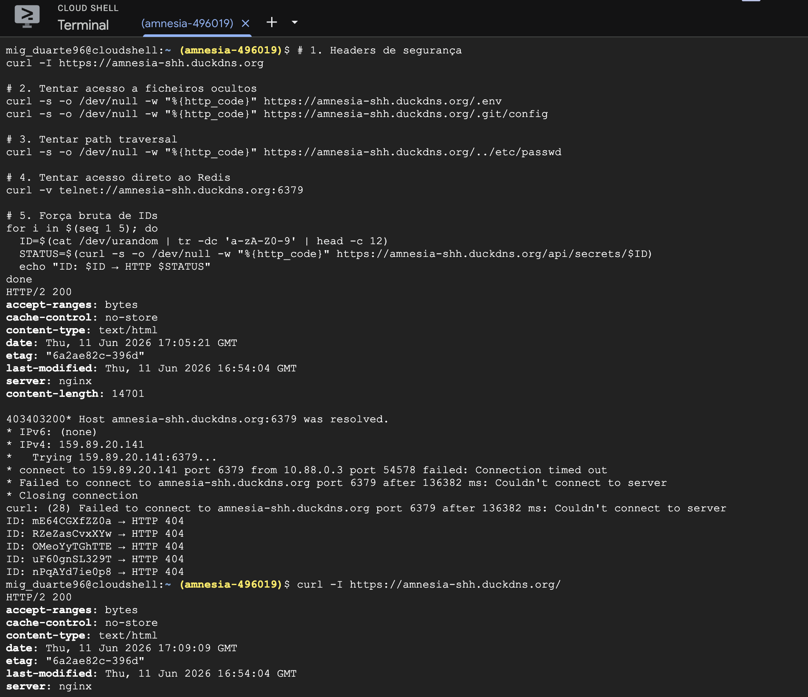 |
| Nikto e Nmap (reconhecimento de portas e vulnerabilidades) | 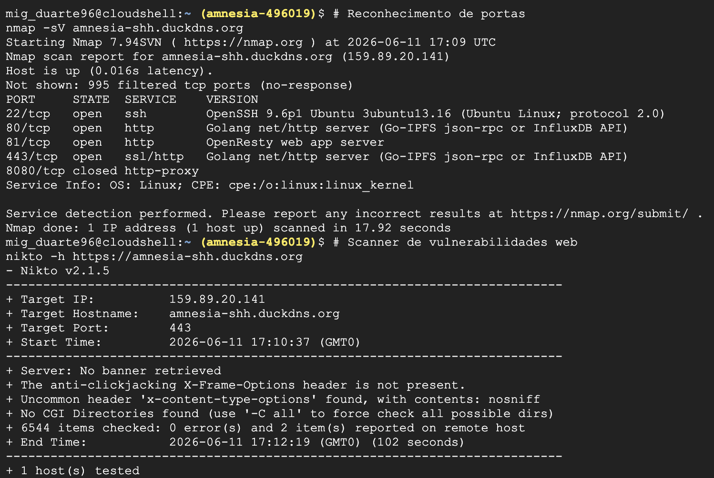 |


---

## Decisões técnicas e trade-offs

| Decisão | Alternativa considerada | Porquê esta escolha |
|---|---|---|
| Redis | PostgreSQL / outra BD relacional | TTL nativo por chave e `GETDEL` atómico resolvem exatamente o problema (expiração + leitura única) sem lógica extra de limpeza |
| AES-256-GCM (Web Crypto API) | OpenPGP.js ou biblioteca de encriptação em JS | API nativa do browser — sem dependências externas para auditar, encriptação autenticada (GCM) e desempenho nativo |
| k3s | Kubernetes gerido (EKS/GKE/DOKS) | Distribuição leve, cabe numa única VPS pequena, sem custo de control plane gerido — adequado à escala e ao orçamento de um projeto académico/portfólio |
| GitOps (ArgoCD) | Deploy push-based (`kubectl apply` direto na pipeline) | O cluster nunca precisa de credenciais expostas ao CI; o `git log` da pasta `k8s/` torna-se o histórico auditável do que está em produção |

---

## Limitações conhecidas e melhorias futuras

- Sem rate limiting aplicacional — um cliente pode criar/ler segredos sem limite de frequência.
- Sem upload de ficheiros — só texto.
- Sem métricas/observabilidade (Prometheus, Grafana) — não há dashboards nem alerting sobre o estado do cluster ou da aplicação.
- `k8s/middleware.yaml` (Traefik `Middleware` CRD) existe mas não está anexado ao `Ingress` — os headers de segurança são hoje garantidos só a nível de nginx/aplicação, não a nível de Ingress.
- Sem testes automatizados (unitários/integração) no repositório nem corridos como *gate* de CI.
- Terraform não provisiona a Droplet em si (sem provider `digitalocean`), só a configura via SSH — criação/gestão da VM é manual.
- `Secret` do Redis com password única partilhada por todos os pods do backend — sem rotação automática.

---

## Créditos e contexto

Este projeto foi desenvolvido na unidade curricular de **Computação Distribuída**, do curso de **Engenharia Informática**.

Desenvolvido em conjunto com [**@JoaoSouza129**](https://github.com/JoaoSouza129).

Arquitetura inspirada no [Yopass](https://github.com/jhaals/yopass) como referência de design — implementação própria, não é um fork.

**Autor desta cópia:** Miguel Duarte — [GitHub @krellz](https://github.com/krellz)

---

## Licença

Distribuído sob a licença MIT — ver [`LICENSE`](LICENSE) para o texto completo.
